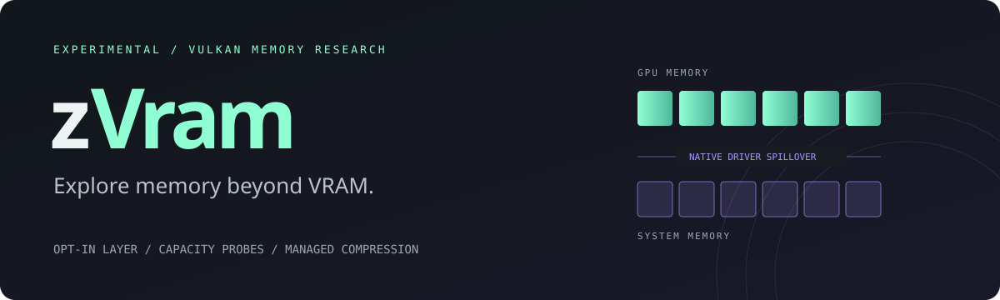

<p align="center"></p>

<p align="center"><b>Experimental GPU memory research · Vulkan · AMD RADV · HIP · C++17</b><br><a href="https://nerdrx.github.io/zVram/">Project website</a> · <a href="#quick-start">Quick start</a> · <a href="VALIDATION.md">Measured results</a> · <a href="KERNEL_PAGING.md">Linux paging research</a></p>

zVram tests GPU memory beyond local VRAM: segmented Vulkan allocations, lossless idle snapshots for eligible Vulkan/HIP allocations, and an explicit managed buffer pool.

**Status: experimental v0.4.1.** The managed pool controls buffers an application explicitly gives it. HIP offers a narrow `hipMalloc` shim with native, mapped-host, and experimental VMM/GTT backing, plus opt-in automatic compression of idle, tracked VMM allocations on one exact ROCm HIP dispatch ABI. The VMM/GTT provider passed a 40 GiB single-pointer integrity check using 20 GiB each of VRAM and GTT. An official 39.73 GB InternLM2.5-20B F16 GGUF also loaded through HIP VMM/GTT with a 36,798.77 MiB GPU model buffer and all 49/49 layers offloaded; the native full-GPU HIP request OOMed. A separate native CPU/GPU HIP run offloaded 24/49 layers and matched VMM output. The same model also completed through the zVram Vulkan virtual heap and matched native Vulkan output. With llama.cpp's own n-gram self-drafting, a repeated-text prompt measured 6.33 versus 1.10 tokens/s and matched output; an ordinary code explanation measured 1.45 versus 1.43 tokens/s but diverged in output. These short sequential runs show workload-specific app behavior, not a zVram or general speedup. A 40 GiB GPU model buffer and broad app compatibility remain unverified. Idle compression is not transparent active-working-set paging.

## Install and update with NX Hub

Refresh NX Hub, select **zVram**, and install **Vulkan launcher and manager
(Linux x86_64)**. Hub also handles later release updates and adds the zVram
Manager desktop entry. From the Hub CLI:

```sh
nx refresh --force
nx install zvram
nx update zvram
zvram gui
```

Requires Linux x86_64, glibc 2.39 or newer, Python 3.9+, Tk, libzstd, and a
working Vulkan driver. Keep `~/.local/bin` on PATH for terminal and Steam use.
The package includes the Vulkan layer, compiled shaders, GUI and TUI. HIP
remains an optional source build. Model serving also requires a Vulkan-enabled
`llama-server` on PATH or an explicit `zvram model setup --server /path/to/llama-server`.
Models are not bundled.

Profiles and logs live in `~/.local/state/zvram`, outside the installed package.
Hub updates preserve this state and existing model files. Reopen the manager
after updating before starting new jobs. Running jobs retain their loaded
backend; stop and relaunch them to use the updated version.

Release tags build a versioned runtime archive, `nx-app.json`, and SHA-256
checksums. To reproduce packaging locally:

```sh
python3 scripts/package.py --build-dir build --output dist --version 0.4.1
```

## What works today

### Userspace manager and Novum Xenium bridge

`zvram gui` opens the NX-themed manager; `zvram tui` opens its terminal interface.
Detect external zVram launches and manage foreground launch profiles, live residency caps on capable Vulkan devices, launch-time presets, process logs,
and physical GPU/system memory telemetry. Only managed zVram launches are
affected. Other apps keep normal driver behavior; no root service is needed.
See [manager usage and limits](docs/manager.md).

`zvram model list` discovers existing local GGUF models. The bridge serves one
through a separate loopback Vulkan llama-server and registers a dedicated
Novum Xenium provider. It does not wrap an already-running Ollama process.
See the [Novum integration handoff](docs/novum-xenium-integration.md).

| Component | Behavior |
|---|---|
| Vulkan launcher and layer | Opt-in allocation telemetry; requests AMD `ALLOWED` overallocation when available and preserves an explicit application policy. |
| Vulkan segmented memory | Experimental virtual GPU-only memory type for eligible storage buffers. Sparse binding backs one logical allocation with native chunks; a 40 GiB single-buffer transfer/readback check passed on the tested RADV driver. |
| Vulkan automatic snapshots | Opt-in idle compression now passes both a standalone buffer integrity test and one unchanged Vulkan llama.cpp run; see the exact limits below. |
| Managed Vulkan pool | Logical IDs, pinned acquire/release, LRU eviction, zstd snapshots with raw fallback, and restore/readback under resident and host-store budgets. |
| HIP allocation layer | Opt-in `hipMalloc` routing to native device memory, mapped pinned host memory, or experimental imported GTT BOs through HIP VMM. |
| HIP cold snapshots | Explicit userspace hibernate/resume for owned VMM allocations: lossless Zstd/raw backing, reserved GPU pointers, and retryable restore. |
| HIP automatic idle snapshots | Opt-in dispatch hooks hibernate tracked VMM allocations after an idle timeout and restore them before resident work. Supported on the tested HIP 7.2.53211 ABI only. |
| Integrity checks | Vulkan transfer and compute readback, compression round trips, and HIP GPU-write/CPU-verify tests. |

RADV already migrates allocations between VRAM and GPU-accessible system memory. Successful native checks demonstrate that driver behavior; they do not attribute extra capacity to zVram. The layer's counters report API allocation requests, not physical residency.

## Experimental Vulkan virtual memory

```bash
# Unchanged memtest sees the configured 96 GiB virtual heap; tests 2 GiB.
./zvram --verbose --isolate-layers --vulkan-virtual-gib 96 -- memtest_vulkan 1 2147483648

# Verify every byte of one 40 GiB logical allocation with chunked staging.
./zvram --validate --isolate-layers --vulkan-virtual-mib 49152 -- \
  ./build/zvram-capacity-check --single-allocation --api2 --mib 40960
```

This userspace mode adds a GPU-only virtual heap/type while preserving native heaps and memory types. On the tested discrete RADV device, it enables sparse binding and promotes storage buffers of at least 1 MiB with storage/transfer usage (and optionally BDA), no creation flags, and no buffer `pNext` chain. Synthetic allocations are backed at bind time by aligned native chunks of at most 256 MiB; native local allocation types are preferred, with compatible system types as fallback. RADV remains responsible for migration between VRAM and RAM. The layer supports multiple eligible, nonoverlapping promoted storage-buffer ranges in one synthetic `VkDeviceMemory`, including aligned nonzero offsets and ranges crossing native-chunk boundaries. It retains range contents across buffer destruction and rebinding. The synthetic allocation remains allocated after buffer destruction; `vkFreeMemory` is deferred until its last bound buffer is destroyed. The 40 GiB transfer check verified one logical allocation, one buffer, and 160 native chunks; unchanged memtest completed a bounded 2 GiB compute check with eight chunks and displayed 40 GB.

The configured heap is a logical cap, not reserved memory or a free-capacity guarantee. Binding can fail if actual backing cannot be allocated. In automatic snapshot mode, a pristine GPU-only native `VkDeviceMemory` can be adopted when its first eligible promoted storage buffer binds, even at a nonzero offset or when smaller than the allocation. The layer adopts the whole allocation as one child and preserves its native memory type, flags, priority, and allocation callbacks. Later eligible, nonoverlapping storage-buffer ranges can share it. This path adds no synthetic backing and permits a native child larger than 256 MiB. Allocations already bound to an ordinary buffer, image, or sparse binding are not adoptable. Once an adopted pool is cold, later ordinary buffer/image binds are refused without waking it. `vkQueueWaitIdle` and `vkDeviceWaitIdle` keep cold snapshots asleep. Binding a cold allocation restores only that allocation; an overlapping bind is rejected before wake. By default, queue submissions restore all cold allocations. Opt-in `--vulkan-selective-restore` restores only whole allocations referenced by recognized compute or transfer submissions; unknown commands and unsupported descriptor or shader paths retain restore-all behavior. Restored allocations remain resident until a later snapshot. Opt-in `--vulkan-active-eviction` lets the worker compress whole allocations with no outstanding tracked use while other tracked queue work is pending. Restoration writes become visible to each app queue on its next intercepted submit through deferred waits, without a device-wide idle. Private queue epoch markers track safe completion, and unknown accesses conservatively keep every candidate resident until their markers retire. A five-case synthetic/native focused gate passed, including restoration before a host-blocked queue was released and an unknown-command guard. Without the separate range option below, this is allocation-granularity eviction. Fault-driven paging remains unsupported. The 40 GiB result verifies transfer integrity for one allocation; it does not establish fast compression of a 40 GiB pool or VRChat/app compatibility. Graphics/presentation and explicit application sparse submissions remain outside the active path. Unknown or mixed pools, images, external/protected memory, capture/replay, synthetic host mapping, and universal active-working-set paging remain unsupported. In automatic snapshot mode, the layer unbinds app buffers before binding private per-child transfer views, copies through each view, then unbinds it; snapshots preserve the whole allocation, including gaps, losslessly. The layer uses a spare sparse queue when available, avoiding a wait on the app queue during binding; without one it retains the synchronous app-queue fallback. In virtual-only mode, unrelated application queues now forward without device-wide snapshot locks or cold-buffer scans; internal sparse-queue work remains serialized. The earlier queue fast path passed seven focused GPU tests and a 62/62 suite; the range suite passed 69/69 and resident-admission suite 75/75; the pre-GDeflate-codec-integration full CTest run passed 101/101 in 68.13 seconds with zero validation errors or VUIDs. Sparse features can be injected through legacy features or a head `VkPhysicalDeviceFeatures2`; other layouts work when the app already enables sparse binding. BDA storage buffers are supported with the required device-address allocation flag. Native buffer/allocation limits remain unchanged; the 40 GiB check used Vulkan 1.1 on this RADV driver. Ctrl+C stops memtest.

Enable selective restoration with `--vulkan-selective-restore` together with `--vulkan-auto-idle-ms`; this requires automatic idle snapshots. Example focused check:

```sh
./zvram --validate --isolate-layers --vulkan-virtual-mib 64 \
  --vulkan-auto-idle-ms 100 --vulkan-cold-mib 64 --vulkan-selective-restore -- \
  ./build/zvram-vulkan-auto-check --selective-submit
```

Add `--vulkan-active-eviction` to test active allocation-granularity eviction. It requires both automatic snapshots and selective restore:

```sh
./zvram --validate --isolate-layers --vulkan-virtual-mib 64 \
  --vulkan-auto-idle-ms 100 --vulkan-cold-mib 64 \
  --vulkan-selective-restore --vulkan-active-eviction -- \
  ./build/zvram-vulkan-auto-check --active-submit --two-queues
```

Opt in to chunk-range residency with `--vulkan-range-mib 32`; it requires automatic snapshots, selective restore, and active eviction. On hardware exposing `sparseResidencyBuffer`, the layer partially binds sparse buffers and selects chunks from narrow descriptor or transfer ranges. A pristine native allocation is segmented into aligned chunks of the configured size, with a smaller final chunk on first eligible bind; default behavior continues to snapshot and evict whole allocations. By default, global `robustBufferAccess` and explicit pipeline robustness conservatively widen tracking to whole buffers; the strict-robustness option below permits bounded robustness2 ranges. Dynamic storage descriptors remain whole-buffer tracked; unknown commands and BDA shaders retain restore-all behavior. The hardware feature and a private queue are required. Default presentation retains the conservative fallback; a narrow opt-in buffer-presentation path is documented below. See [range-residency evidence and limits](VALIDATION.md#vulkan-range-residency).

```sh
./zvram --validate --isolate-layers --vulkan-virtual-mib 64 \
  --vulkan-auto-idle-ms 100 --vulkan-cold-mib 64 \
  --vulkan-selective-restore --vulkan-active-eviction --vulkan-range-mib 32 -- \
  ./build/zvram-vulkan-auto-check --range-submit
```

The range path passed a 64 MiB two-chunk integrity check and one unchanged small-model cold-restore run. This does not establish sustained model serving, 40 GiB compression speed, VRChat compatibility, or graphics/presentation support. See [range-residency evidence and limits](VALIDATION.md#vulkan-range-residency) and [active eviction evidence](VALIDATION.md#active-vulkan-eviction).

Opt in to resident admission with `--vulkan-resident-mib N`; it requires `--vulkan-range-mib`. Completed tracked chunks can be evicted before an eligible restore so tracked resident backing stays within the configured limit. `--vulkan-eviction-policy lru|mru` selects which eligible completed chunk is evicted first; it also requires resident admission and defaults to `lru`. MRU selects the newest completed, unselected chunk first. The policy does not change the existing protection for in-flight, selected, or otherwise ineligible chunks. `--vulkan-resident-after-cold` arms admission only after the first complete cold pass, allowing startup/model loading to exceed the limit. This is not a global VRAM cap: it accounts for tracked buffer backing only, while images, graphics, and other untracked allocations are outside it. A submission whose full known working set exceeds the limit is refused and may OOM; this option does not promise arbitrary applications remain usable.

The 192 MiB model check completed its cold pass before arming admission, then held tracked backing to a 165.8125 MiB peak while producing identical native/wrapped output and retaining 31/31 layer offload. This is a bounded correctness and behavior check, not proof of 40 GiB streaming or a speedup. See [resident-pressure evidence and limits](VALIDATION.md#vulkan-resident-pressure-admission).

```sh
python3 check_vulkan_idle_model.py --binary build/third-party/llama-vulkan-build/bin/llama-completion --model build/third-party/models/SmolLM2-135M-Instruct-f16.gguf --tokens 64 --idle-ms 100 --range-mib 32 --resident-mib 192 --resident-after-cold --strict-robustness --max-nodes-per-submit 1 --validate --output-dir build/vulkan-pressure-model-normal --timeout 120
```

The launcher option `--vulkan-clean-cache` (model helper: `--clean-cache`) keeps verified compressed backing after a restore and reuse it on a later cold transition. This requires `--vulkan-range-mib`; the cold and clean snapshots share the bounded `--vulkan-cold-mib` quota. Proven read-only SPIR-V `NonWritable` descriptors and copy sources can reuse cached data. Accepted writes invalidate affected chunks, and an accepted access the layer cannot classify invalidates all cached chunks. Failed submits preserve the cache. Cache entries are expendable and trimmed under quota pressure. A paired 135M F16 check passed 25/25 checks, retained identical output, and recorded 405 reuses with 3 invalidations. Throughput measured 2.82 tokens/s for the resident-pressure baseline and 6.23 with the cache in separate short runs; this is not a general speed claim or a 40 GiB/game result. See [clean-cache evidence and limits](VALIDATION.md#vulkan-clean-snapshot-cache).

To bound expendable clean copies separately, add `--vulkan-clean-cache-mib N` alongside `--vulkan-clean-cache`. The positive MiB cap must fit within `--vulkan-cold-mib`; cold and clean data still share that total quota. Omitting the cap preserves existing behavior. Trimming keeps lossless cold snapshots intact, but can require fresh compression later.

BP16 also has a default-off [raw-host-input experiment](research/bp16/README.md#experimental-raw-host-input) that reuses budgeted GPU-readable raw snapshots. An alternating 27B Q4 forced-spill trial measured about 30% higher token rate with it enabled; this is workload-specific, with exact commands and limitations in the linked evidence.

Set `--vulkan-min-savings-percent N` to keep a lossless raw snapshot when Zstd would save less than the requested 0–100 percent. It requires automatic Vulkan snapshots; the default `0` preserves the prior any-savings behavior. At `100`, the layer skips Zstd compression and decompression and keeps snapshots raw. Raw snapshots share the cold and clean-cache quota, so they use more RAM and can be refused when the quota cannot hold them; data is never quantized or discarded. The helper exposes this as `--min-savings-percent N`. CPU boundary checks and synthetic/native full-byte GPU checks passed. In one matched 135M F16 model pair, 100% mode measured 17.53 versus 8.26 tokens/s at 0%, while both remained far below native at 125.63 and 121.84 tokens/s. This single pair is workload-specific, not a general speed claim or a 40 GiB/game result. See [cutoff evidence and limits](VALIDATION.md#vulkan-compression-savings-cutoff).

`--vulkan-byte-shuffle 2` or `4` optionally groups byte planes before Zstd, then reverses that permutation during restore. It preserves every byte, including incomplete trailing elements; RAW fallback keeps original bytes. It requires automatic snapshots and is disabled by default. SSE2 accelerates the filter on x86; other targets use a portable implementation. A 32 MiB F16 slice stored about 12% fewer compressed bytes with stride 2. This option has CPU correctness coverage only: GPU restore, large-model throughput, and game behavior remain unverified. Each simultaneous filtered decoder needs up to 32 MiB additional temporary RAM, bounded to 128 MiB for four workers. The model helper accepts `--byte-shuffle 2` or `4` and requires evidence of actual filtered chunks. See [filter measurements](VALIDATION.md#lossless-byte-plane-filter) and the separate [research-only GDeflate decoder](research/gdeflate/README.md).

The bounded GDeflate shader research fork passed exact-byte decoding of 64 KiB, 1 MiB, and 32 MiB F16 inputs on CPU llvmpipe and on the RX 7900 XTX wave32 path, with zero validation errors or VUIDs. The 32 MiB case covered 512 tiles and took 5.792 ms GPU decode in one standalone iteration. This is shader/component correctness, not model inference or token throughput. The decoder is now available through the separate opt-in GPU restore path below; these standalone timings do not measure that path. See [decoder evidence and limits](VALIDATION.md#research-only-gdeflate-decoder).

An optional **CPU GDeflate snapshot codec** can be enabled with `-DZVRAM_ENABLE_GDEFLATE=ON`; builds and launches default to Zstd. The `--vulkan-codec gdeflate` path requires automatic snapshots, rejects byte-shuffle and rejects launches if the codec was not built. Use `--build-dir build/gdeflate-codec` to launch against the separate feature-enabled build. Codec tags survive direct restore and decode-ahead. A CPU-only 32 MiB F16 round trip was exact, but one GDeflate encode/`decodeOne` took 355.970/114.457 ms and produced a slightly larger stream (27,219,160 bytes) than Zstd at 19.194/13.907 ms (26,673,213 bytes). A separate 320 MiB synthetic Vulkan-layer test passed two cold/wake compute cycles with full-byte verification. This is not a speed gain, model inference, or general application compatibility result. See [codec details and CPU build instructions](research/gdeflate/README.md#optional-cpu-snapshot-codec) and [the validation record](VALIDATION.md#optional-cpu-gdeflate-snapshot-codec).

Compute write proofs are now associated with the pipeline/set pairing at each dispatch, preserving the conservative resource union and mixed-graphics fallback. Optimized CPU checks and full-byte GPU regressions pass; see [the scope and evidence](VALIDATION.md#dispatch-scoped-compute-write-attribution).

On a supported wave32 device, `--vulkan-gdeflate-gpu` opts into direct GPU restore for compressed GDeflate chunks; it requires `--vulkan-codec gdeflate` and automatic snapshots. Zstd remains the default, and without this flag GDeflate restore stays on CPU. Compressed chunks up to 32 MiB decode directly into private sparse backing views; RAW chunks use the CPU/copy path. `--vulkan-gdeflate-workers 1..32` sets CPU encoding parallelism and defaults to `1`. Recoverable GPU errors are counted and fall back to CPU; unsafe fence/device failures stop reuse. A small-model run passed 14/14 checks with matching output and 31/31 layers, recording 11 GPU calls over 308,084,736 bytes with zero fallback or validation diagnostics. Its timing overlapped synthetic GPU tests and is not a speed comparison. GPU input, upload, and scratch allocations sit outside the tracked backing cap and can raise temporary memory peaks. The focused layer suite now passes 5/5, including compressed synthetic and native ranges; RAW restores in their second cycle correctly use CPU. This is not a 40 GiB GPU restore or general application compatibility result. See [GPU GDeflate restore evidence and limits](VALIDATION.md#opt-in-gpu-gdeflate-restore).

The BP16 restore-batching and combined-remap prototypes were removed from the current runtime after two full-model runs showed no observed speed gain. Their exact-output results and reproducible implementation patch are archived in [the research record](VALIDATION.md#experimental-bp16-restore-batching-prototype-removed); those historical flags are not current CLI options.

With range residency and an immediate `--vulkan-resident-mib` cap, `--vulkan-lazy-backing` starts pristine eligible chunks unallocated and allocates/binds them before admitted use. It does not copy undefined initial bytes; after initialization, chunks use the normal lossless snapshot path. Restore preflight refuses requests whose tracked working set would exceed the cap. Lazy backing rejects `--vulkan-resident-after-cold`, which would delay admission. A CPU production-path harness passed checks for zero-allocation startup, exact-cap restore, pre-allocation refusal one byte over cap, disjoint binding while cold, initial-bind rollback, allocation retry, and sticky sparse-failure accounting, plus conservative unknown-submit admission/restore. Tiny hardware and small-model gates passed; game and 40 GiB behavior remain unverified. Allocation or bind failure can prevent paging; swapchain presentation uses the conservative fallback by default, and explicit app sparse submissions remain unsupported, so treat this as experimental for controlled compute/offscreen use. This is not a global VRAM cap.

`--vulkan-buffer-presentation` opts into keeping buffer paging across base Vulkan presents and allowlisted present-ID/region metadata; it requires active eviction. Native swapchain images stay unpaged. At most one `VkPresentIdKHR` and one `VkPresentRegionsKHR` with matching swapchain counts are forwarded unchanged; other chains keep the conservative full-restore/disable fallback. A hidden Gamescope X11 fixture passed three cold-restore draw/readback frames with exact pixels and a full 32 MiB check. A native headless Gamescope Wayland control timed out with `VK_ERROR_OUT_OF_DATE_KHR` without loading the layer, so evidence is X11-only. This is fixture correctness, not game compatibility or frame-time evidence. See [the supported path and limits](VALIDATION.md#base-buffer-presentation-opt-in).

`--vulkan-async-compression` opts into worker-only compression for at most one eligible idle range of up to 32 MiB; it requires active range paging and is disabled by default. Admission-triggered compression stays synchronous. The worker captures GPU data and restores application aliases under device and queue locks, then releases both locks during CPU encoding. Before committing the snapshot, it rechecks identity, binding/child generations, accepted-write epochs, pending references, the paging gate, and budget; stale candidates are discarded. Hidden X11 tests passed with async Zstd and with GDeflate using 32 CPU encoding workers plus direct GPU restore. These prove correctness only, not speed or frame time. Reproduce and see the limits in [the async-compression evidence](VALIDATION.md#asynchronous-idle-range-compression-opt-in).

`--vulkan-recover-local` (or `ZVRAM_VULKAN_COLD_CYCLE_RECOVERY=1`) opts into recovery of completed explicit nonlocal backing after native VRAM headroom returns. It requires pressure-only active range paging with native-budget headroom. After one second without use, the worker can move one compatible child of up to 32 MiB directly into local memory with one GPU copy; configured caps still apply. Recovery creates no host snapshot, performs no compression and consumes no cold-storage quota. Oversized children and callback-owned pools are excluded before choosing the oldest candidate. Recovery is synchronous and can delay submissions, so it is disabled by default. This does not control device-local allocations transparently migrated by the kernel into GTT. See [direct-copy checks and latency limits](validation/direct-gpu-recovery/README.md).

`--vulkan-recover-local-quiet-ms N` adjusts that unused-age delay while recovery is enabled (default 1000; accepts 0 through 4294967295 milliseconds). Setting 0 permits recovery between completed uses of frequently accessed buffers; pending GPU work remains protected. This changes eligibility, not transaction cost: recovery still holds submission locks and may cause a frame spike. The equivalent environment variable is `ZVRAM_VULKAN_RECOVER_LOCAL_QUIET_MS`.

`--vulkan-headroom-mib N` further tightens the tracked backing cap using `VK_EXT_memory_budget` on a single native device-local heap. It requires lazy backing, immediate resident admission, an enabled Vulkan 1.1 or `VK_KHR_get_physical_device_properties2` instance path, and device support for `VK_EXT_memory_budget`. Unsupported setups are rejected. A tiny hardware test verified budget queries and pre-allocation refusal at a zero effective limit. This dynamic budget estimate is not reserved capacity or a global VRAM guarantee; see [the calculation and limits](VALIDATION.md#vulkan-memory-budget-headroom-opt-in).

A 5% cutoff also completed the 16.8107 GB Q4 model with 27/27 checks, identical output, 66/66 layers, and mixed compressed/RAW snapshots under a 12 GiB tracked cap. It measured 0.41 tokens/s versus 13.30 native; the prior no-cutoff run measured 0.28 versus 6.00, so this does not isolate a cutoff speed benefit. This validates a slow large-model path, not 40 GiB or game behavior.

In the matched small-model scan comparison, LRU and MRU each passed 26/26 checks with identical output. MRU measured 8.36 tokens/s versus 6.23 for LRU in one run each, while native reference runs measured 119.43 and 122.04 tokens/s respectively. This is a workload-specific, single-run result with throughput variance; it does not establish a general speedup, 40 GiB behavior, or game performance. See [eviction-policy evidence and limits](VALIDATION.md#vulkan-range-eviction-policy).

A longer-idle MRU run completed the unchanged 16.8107 GB Q4 model under a 12 GiB tracked-residency cap, with 26/26 checks, identical output, 66/66 layers, and 4,952 pressure admissions. It measured 0.28 tokens/s versus 6.00 native, so this establishes functional large-model coverage but shows a substantial slowdown. No large-model LRU comparison was run; this is not a 40 GB model or game result. See [long-idle model evidence and limits](VALIDATION.md#vulkan-range-eviction-policy).

An unchanged **39,725,643,136-byte InternLM2.5-20B F16** model also completed Vulkan inference with automatic compression and MRU admission: **28/28** checks, identical native/wrapped output, and **49/49** layers offloaded. After the first cold pass, tracked backing peaked at **21,471,690,752 bytes** under the **20 GiB** cap, with **1,212** admission events and no refusals or restore fallbacks. Cold storage retained **38,749,798,400 logical bytes** in **29,595,160,469 bytes** (**23.62% saved**); the cap applies only to eligible tracked backing, and the admission cap does not apply during bootstrap. Across 12 actual decode runs the wrapped path measured **0.09 tokens/s** versus **1.44** native. This is slow, model-specific compressed-pressure inference evidence, not a 40 GiB GPU model, game, universal compatibility, or fast-inference result. See [the run details and evidence](VALIDATION.md#internlm25-20b-f16-under-vulkan-tracked-residency-pressure).

For ranges above 32 MiB, snapshot decode can use up to three background workers plus the calling thread into existing staging (bounded to 128 MiB); GPU freeze/restore batches up to four 32 MiB frames per copy/wait. The newer bounded pipeline uses two host staging slots of at most 128 MiB each to overlap decoding the next admitted cold child with the current GPU copy, with at most four CPU workers per restoration. Second-slot allocation failure falls back to serial processing; whole-pool and oversized snapshots stay serial, and GPU allocations remain within resident admission. The pre-GDeflate-codec-integration full suite passed 101/101 in 68.13 seconds and the focused helper/pipeline suite passed 4/4 in 4.31 seconds, with no validation errors or VUIDs. An earlier guarded 20B attempt stopped before a complete cold pass or prompt input. A later first-submit 20B attempt matched output and 49/49 layers but failed snapshot checks after 420 pre-prompt and 646 final failures, so its 0.24 tokens/s is rejected. A subsequent long-idle retry passed 27/27 with 49/49 layers and identical output at 0.19 tokens/s, unchanged from the prior accepted run; it shows no speed gain. The completed-restore peak stayed below 20 GiB, while the all-state observed peak briefly exceeded it, since the cap checks admissions and completed restores rather than every transient allocation. See [bounded parallel decode and first-submit pressure evidence](VALIDATION.md#bounded-parallel-decode).

The model helper accepts the same choice with `--eviction-policy lru|mru`. Its optional `--min-available-mib N` guard aborts the helper's child process group when system-wide Linux `MemAvailable` falls below that floor; it is a safety stop, not a hard allocation cap.

```sh
python3 check_vulkan_idle_model.py --binary build/third-party/llama-vulkan-build/bin/llama-completion --model build/third-party/models/SmolLM2-135M-Instruct-f16.gguf --tokens 64 --idle-ms 100 --range-mib 32 --resident-mib 192 --resident-after-cold --strict-robustness --max-nodes-per-submit 1 --validate --clean-cache --output-dir build/vulkan-clean-cache-model --timeout 120
```

The focused pressure check enforces its 32 MiB limit from the first submission. Add `--native-allocation` to exercise native allocation adoption:

```sh
./zvram --validate --isolate-layers --vulkan-virtual-mib 128 \
  --vulkan-auto-idle-ms 60000 --vulkan-cold-mib 64 \
  --vulkan-selective-restore --vulkan-active-eviction \
  --vulkan-range-mib 32 --vulkan-resident-mib 32 -- \
  ./build/zvram-vulkan-auto-check --range-pressure
```

 `--vulkan-strict-robustness` opts into supported `VK_EXT_robustness2` behavior and includes descriptor alignment in range tracking. Explicit weaker robustness1 stays whole-buffer tracked, and dynamic storage descriptors remain conservative whole-buffer cases. Without this option, core `robustBufferAccess` keeps whole-buffer tracking.

An unchanged SmolLM2-135M F16 run with active mode enabled also passed all 12 checks, retained 31/31 layer offload, and produced byte-identical native and wrapped output. This is one integration and cold-restore result, not a speed claim.

Choose the heap size at each launch with `--vulkan-virtual-gib 96`, or use `--vulkan-virtual-mib 98304` for the same 96 GiB budget. Use one size option per launch. There is no artificial upper cap; only positivity and Vulkan's 64-bit byte-size overflow are checked. The heap remains a logical budget. Full 40 GiB backing is verified; both 48 GiB and 96 GiB settings passed bounded 2 GiB memtest checks. Full 48 GiB or 96 GiB backing remains unverified.

### Automatic idle snapshots (narrow experimental path)

`--vulkan-auto-idle-ms 100 --vulkan-cold-mib 512` opts eligible app-created storage buffers into lossless idle snapshots. This was validated with one 320 MiB buffer, two native backing chunks, and a 32 MiB coherent staging buffer. The first idle snapshot retained 12,263,515 bytes (96.345% smaller); after GPU mutation to randomized data, the next snapshot used raw 335,544,320-byte backing. Two GPU XOR wake cycles verified every byte while the `VkBuffer` handle stayed stable. Cold metadata queries and freeing a cold buffer did not restore it. A 1 MiB cold-store budget refused eviction and preserved the original contents. Budget refusals stay suppressed until new queue work or cold-store release, while other transient snapshot errors remain retryable. A 14 MiB release test froze a 192 MiB buffer, freed its cold backing, then froze and byte-verified a 256 MiB buffer without another GPU submission.

The first cold transition released exactly 335,544,320 bytes of process DRM resident VRAM (345,059,328 to 9,515,008 bytes); resident GTT stayed at 69,210,112 bytes. The standalone tests now also cover partial child release and retry after an injected partial-restore OOM; see the validation logs. A separate unchanged 135M F16 llama.cpp Vulkan run passed with automatic snapshots enabled: 31/31 layers offloaded, native and wrapped stdout matched exactly, and 307,998,976 cold logical bytes were stored in 207,039,004 bytes before input. The tested path covers multiple queues/families and BDA for this app's native GPU-only allocations. Native-pool adoption remains limited to pristine GPU-only allocations and eligible nonoverlapping storage-buffer ranges. Images, external/protected memory, capture/replay, and active fault-driven paging remain unsupported. Active work still needs native VRAM plus GTT.

```sh
# 96 GiB logical heap, narrow 320 MiB idle-snapshot integrity check
./zvram --verbose --isolate-layers --vulkan-virtual-gib 96 \
  --vulkan-auto-idle-ms 100 --vulkan-cold-mib 512 -- ./build/zvram-vulkan-auto-check

# Compare an unchanged Vulkan llama-completion run with automatic idle snapshots
python3 check_vulkan_idle_model.py --binary /path/to/llama-completion \
  --model /path/to/SmolLM2-135M-F16.gguf
```

See [hardware evidence and limits](VALIDATION.md#automatic-vulkan-idle-snapshots).

In automatic mode, eligible exact-size GPU-only native allocations use stable app-facing memory tokens and can be adopted into snapshots. A private sparse/transfer queue performs copies. In the default mode, completion markers postpone snapshots while app work is pending; opt-in active eviction can snapshot whole allocations unused by tracked pending submissions. Unknown access protects all candidates. The tested path supports ordinary and internally synchronized queues, BDA, and cross-family storage-buffer barriers. By default, app presentation or explicit sparse submissions keep the conservative restore-all/paging-disable behavior; `--vulkan-buffer-presentation` opts into base presents plus allowlisted present-ID/region metadata. Explicit application sparse submissions and other presentation chains retain the fallback. Active eviction is allocation-granularity, not frame-by-frame compression or general image paging.

Steam launch options can chain CPU affinity, using the installed `zvram` command:

```text
zvram --vulkan-virtual-gib 96 -- taskset -c 1-7,16-23 %command%
```

## Managed Vulkan buffer pool

Include [`managed_pool.hpp`](managed_pool.hpp) and link `zvram_pool`. The pool owns each Vulkan buffer and allocation. `upload` creates a stable logical ID; `acquire` returns the current `VkBuffer` and pins it; `release` is valid only after the caller has synchronized all GPU work using that buffer. By default a restored allocation can have a different `VkBuffer`, so refresh descriptors and other references after every acquire. With `Config::stableSparseBuffers = true`, each buffer keeps its handle while physical backing is removed and restored through sparse binding. That mode requires `sparseBinding` and `sparseResidencyBuffer` enabled at device creation, plus a sparse-binding transfer queue; physical support checks cannot verify what the caller enabled on an existing device. It still requires the same explicit acquire/release boundaries. Serialize all calls on a pool instance. The supplied queue must be externally synchronized with pool calls.

The pool assumes resident data can be modified by GPU work and reads it back before eviction. Host storage uses zstd when smaller and raw bytes otherwise. Snapshot encoding and restoration stream by staging chunk; temporary codec scratch is bounded by the configured chunk and zstd compression bound, while caller-owned readbacks are outside the pool budget. The pool is an explicit application integration API. Sparse mode rebinds memory at synchronized application boundaries; it does not supply fault-driven paging or discover arbitrary application buffer use. After an uncertain queue operation the pool retains backing and stops further acquire/upload operations.

## HIP allocation layer

Builds when HIP/ROCm development files are available. The `--hip` shim covers `hipMalloc`/`hipFree`; it is not a general HIP memory manager, and asynchronous free of a mapped-host fallback is rejected. `--hip-local-mib` caps native device allocation bytes; without `--hip-vmm`, overflow uses mapped pinned host memory, while `--hip-host-mib` sets its cap. Mapped host is system RAM, not compressed storage.

With `--hip-vmm`, overflow is backed by AMDGPU GTT buffer objects exported through libdrm and imported into one HIP VMM virtual address range. This experimental path requires the `libdrm_amdgpu` development files in addition to ROCm/HIP. One 40 GiB synthetic integrity check passed with 20 GiB each of local VRAM and GTT backing. The native full-GPU load of a 39.73 GB InternLM2.5-20B F16 model OOMed; its VMM/GTT run allocated the full model buffer and generated output. An earlier HIP host-location VMM provider failed and consumed VRAM in a separate probe; that superseded path is not the current GTT provider. See the [model capacity evidence](VALIDATION.md#internlm25-20b-f16-model-capacity).

By default HIP capacity queries keep reporting native physical capacity. `--hip-report-capacity` opts into reporting the configured local cap plus available GTT-backed tier through `hipMemGetInfo`, `hipDeviceTotalMem`, and the installed `hipGetDeviceProperties` ABI. Supported `hipGetProcAddress` lookups also return these wrappers when their ABI matches the installed runtime. Use it only with `--hip-vmm`, an explicit `--hip-local-mib`, and a positive `--hip-host-mib`; it does not change physical VRAM, external queries, or older property-query ABIs. This logical report passed both an 80 MiB three-query consistency check and a 40 GiB single-pointer GPU integrity run. It applies only to those HIP entry points and does not reserve memory or promise general application compatibility. See [validation details](VALIDATION.md#hip-vmm-research-probe).

## Userspace HIP hibernation

The experimental C API in [`hip_hibernate.hpp`](hip_hibernate.hpp) adds `zvramHipHibernate(coldBudgetBytes)`, `zvramHipResume()`, and `zvramHipColdBytes()` to the preloaded HIP library. It needs no root service or driver patch. Only zVram-owned VMM allocations participate; native and mapped-host allocations remain outside this path. The caller must serialize all HIP/HSA activity, hibernate only at a safe idle boundary, and successfully resume before using any cold pointer.

An optional HIP dispatch bridge can automate that lifecycle for supported HIP calls. Its automatic mode was tested with the installed ROCm HIP 7.2.53211 dispatch ABI (major 0, step 18, 4,056-byte table; bridge runtime version 70200, 506 slots). Other ABI versions/stacks disable automatic mode. The bridge covers direct calls, `hipGetProcAddress`, and native `dlsym` resolution. It closes HIP entry while snapshotting, drains earlier GPU work, and restores all cold tracked VMM allocations before resident work proceeds. Capture and host callbacks restore cold data and disable later automatic snapshots. IPC, external allocations, raw VMM, and memory pools are outside the supported path. Raw HSA and direct submissions outside HIP dispatch are also untracked; profiler bridge conflicts are rejected.

Enable it explicitly with `--hip --hip-vmm --hip-auto-idle-ms 1000 --hip-cold-mib 1024`. The idle timeout and cold-store limit are required. This is process hibernation: while work runs, the full active working set must fit in VRAM plus GTT. It does not provide universal paging or compressed active inference. A small unchanged 135M F16 llama.cpp run, with HIP graph capture disabled, ran with automatic mode and matched native stdout, with all 31/31 layers offloaded; 307,704,064 logical cold bytes compressed to 206,994,149 retained bytes. The existing Odysseus 27B Q4_K_M model also matched stdout after idle restore: 16.15 GB logical buffers retained 15.70 GB cold payload (2.78% saved), with 41.8 s background compression and an 11.5 s wake. At identical 8 GiB VRAM/RAM placement, decode measured 2.91 tokens/s without automatic mode and 2.94 tokens/s with it. These single runs do not measure the total loss versus fully GPU-resident Odyssey inference.

Snapshots use bounded mapped staging and GPU copies, with lossless Zstd or raw fallback per chunk. GPU virtual addresses stay reserved while allocation handles and GTT BOs are released. Cold backing stops consuming the configured resident caps; another allocation can use that capacity, so resume can return out-of-memory until it is released. An undersized cold budget refuses before eviction; later failures retain recoverable snapshots/backing. Resume maps the full allocation before restoring it, so it needs room for active backing plus the remaining cold snapshots.

On the RX 7900 XTX, 32 MiB and 288 MiB mixed-data allocations passed two GPU-mutated cycles, full native readback, stable pointers, budget refusal, resident-cap reuse, failed-remap recovery, and cold free. The 288 MiB allocation stored 151,014,528 bytes; its process DRM client released 16 MiB of VRAM and 272 MiB of GTT while cold. These are synthetic explicit lifecycle checks, not compressed inference or general application paging. See [evidence and reproduction](VALIDATION.md#userspace-hip-hibernation). The GPU copy helper targets `ZVRAM_HIP_ARCH` (default `gfx1100`); other architectures and multiple GPUs have not been validated.

## Quick start

Requires Linux, CMake, a C++17 compiler, Python 3, Vulkan headers and loader, glslc, and zstd development files. HIP tests are optional and require ROCm/HIP tooling; the VMM/GTT path also needs libdrm AMDGPU development files. The GPU checks select a discrete AMD device.

```sh
git clone https://github.com/nerdrx/zVram.git
cd zVram
cmake -S . -B build -DCMAKE_BUILD_TYPE=Release
cmake --build build -j

# Observe allocations for one Vulkan process.
./zvram -- your-application its-arguments

# Managed Vulkan compute, eviction, restoration, and integrity check.
./zvram --validate --isolate-layers -- ./build/zvram-managed-check

# Stable-buffer sparse compute and negative integrity checks.
./zvram --validate --isolate-layers -- ./build/zvram-sparse-check ./build/managed_check.spv

# Real-file lossless roundtrip, bounded to files up to 512 MiB.
./zvram --validate --isolate-layers -- ./build/zvram-file-pool-check --file model.gguf --sparse

# Optional HIP probe: 40 GiB live with 20 GiB local and 20 GiB mapped-host caps.
./zvram --hip --hip-local-mib 20480 --hip-host-mib 20480 -- \
  ./build/hip_check --mib 40960

# Experimental HIP VMM/GTT path: one 40 GiB pointer and opt-in capacity reporting.
./zvram --hip --hip-vmm --hip-report-capacity \
  --hip-local-mib 20480 --hip-host-mib 20480 -- \
  ./build/hip_check --single-allocation --mib 40960

# Small three-query capacity consistency check (80 MiB configured total).
./zvram --hip --hip-vmm --hip-report-capacity --hip-local-mib 16 --hip-host-mib 64 -- \
  ./build/zvram-hip-capacity-check

# Experimental automatic compression of idle tracked HIP VMM allocations.
./zvram --hip --hip-vmm --hip-local-mib 64 --hip-host-mib 2048 \
  --hip-auto-idle-ms 1000 --hip-cold-mib 1024 -- \
  ./your-hip-application
```

The launcher uses the build directory beside itself. Reconfigure CMake after moving the checkout so its layer manifest points to the current library.

## Unmodified HIP application check

[`check_primbench.py`](check_primbench.py) fetches two hash-verified files from a pinned official ROCm commit and builds the unchanged HIP copy example. Run `python3 check_primbench.py --run` to check native execution and VMM/GTT spillover with a 32 MiB local cap. Its two 32 MiB data buffers and internal 256 MiB cache buffer exceed that cap; the upstream assertion checks only the first three copied values. This is an application integration gate, not full-buffer integrity, model validation, or a performance comparison. Full logs and limits are in [VALIDATION.md](VALIDATION.md#unmodified-rocm-application).

## Scoped kernel paging probe

[`dmem_probe.py`](dmem_probe.py) has a read-only `--inspect` mode and an opt-in privileged `--run` mode:

```sh
python3 dmem_probe.py --inspect
sudo python3 dmem_probe.py --run
```

The run creates one temporary cgroup, limits the selected AMDGPU VRAM region to 16 MiB by default, caps child RAM and swap, and runs only the 64 MiB capacity integrity check. It requires root cgroup-v2 `dmem` and `memory` controllers to already be available and enabled. The helper changes no global swap or TTM settings and removes its cgroup on exit. It measures cgroup accounting and integrity only; it does not prove that TTM shmem pages reached swap, nor that GPU data was compressed. See [the kernel paging notes](KERNEL_PAGING.md).

## Validation

The current hardware evidence and exact commands are in [VALIDATION.md](VALIDATION.md). An official 39.73 GB InternLM2.5-20B F16 model passed a VMM/GTT inference run with a 36,798.77 MiB GPU model buffer; native full-GPU allocation OOMed. A separate native CPU/GPU-offload run matched VMM output and measured 1.38 versus 1.09 tokens/s. This is not a full-GPU baseline or a 40 GiB GPU-weight test. A separate full-file roundtrip of the 270,885,952-byte SmolLM2 F16 GGUF stored 207,311,475 bytes (23.47% saved) under a 16 MiB resident budget, in both default and sparse modes. That is one measured file, not a prediction for other models or proof of universal application compatibility.

## Development

```sh
cmake --build build -j
ctest --test-dir build --output-on-failure
```

GPU tests require supported AMD hardware and the relevant runtime. Contributions should include reproducible workloads and distinguish native driver behavior from zVram behavior.

MIT licensed.

### Check an existing model

`check_model.py` runs an existing unmodified llama.cpp HIP `llama-completion` with an existing GGUF, compares native/zVram output, and verifies full layer offload, actual model-buffer size, and cleanup. It disables llama.cpp's fit pass and unified-memory shortcut so the tested buffers use `hipMalloc`. It does not download or quantize a model.

```sh
python3 check_model.py --binary /path/to/llama-completion --model /path/to/model.gguf \
  --local-mib 64 --host-mib 2048 --min-model-mib 250
```

For a model that exceeds physical VRAM, `--vmm-only` skips native comparison and explicitly makes no native-baseline claim. Set backing caps to match available resources; the configured total must also accommodate context and compute allocations. Logs and the JSON report default to `build/model-check`. A small F16 model passed the reproducible comparison. Two existing Odysseus models (30B and 27B) passed separate and concurrent VMM-only checks; their combined actual GPU model buffers were about 34.2 GB. See [the measured limits and logs](VALIDATION.md#existing-odysseus-models).


The newer full 39.73 GB F16 model run completed with lazy backing under a 16 GiB tracked cap and output identical to native. It remains extremely slow: **0.03319 tokens/s versus 1.69 native** across 12 actual decode runs. GPU decompression and MRU caching are being evaluated separately. See [full run evidence and limits](VALIDATION.md#full-internlm-lazy-backing-under-16-gib).

### Experimental BP16 snapshots

BP16 losslessly packs constant bits within blocks of 128 16-bit words. It accepts
any byte data in complete 256-byte blocks; unsupported sizes or frames without
savings retain exact RAW bytes. It is built in without an external codec library,
with Zstd remaining the default. Opt in with `--vulkan-codec bp16`; add
`--vulkan-bp16-gpu` for GPU restoration. `--vulkan-bp16-workers 1..32` controls
bounded CPU packing (default 1). `--vulkan-bp16-upload-workers 1..8` optionally
parallelizes copies into the BP16 GPU upload buffer; it requires BP16 GPU restore
and automatic snapshots, defaults to 1, and is ignored by GDeflate.
A four-frame BP16 restore-batching prototype and a combined sparse-remap variant
were tested in historical builds. Both model runs preserved exact output, but
neither showed an observed speed gain, so these features were removed from the
current runtime and their flags are not supported by the current CLI. The
implementation patch and measurements are archived below.
An owned-input staging prototype passed CPU/GPU correctness checks but was
removed from the current runtime after a full-model experiment measured
0.5078 tokens/s versus 1.1025 for the encoder repeat. It is research-only, not a
supported current CLI mode; see [the archived result and limits](VALIDATION.md#experimental-bp16-owned-input-staging-prototype).
Byte shuffle is restricted to Zstd.

The paired 32 MiB component check measured median GPU decode at 0.118 ms for BP16
and 5.78 ms for GDeflate, with exact bytes over three iterations. BP16 stored
87.0% of raw bytes versus GDeflate's 81.1% on that slice. These are decoder-only
measurements, not a model speedup. [Component evidence](validation/bp16-component).

The best measured 12-token InternLM2.5-20B F16 BP16 short run completed at
**0.61020197 tokens/s** (reported as 0.61), with exact output, 49/49 layers,
and zero GPU fallback. It used 32 BP16 encoding workers, eight opt-in upload
workers, an 8 GiB allocated-host cache, a 19 GiB tracked-residency cap, and a
24 GiB cold/cache quota. A repeat with eight upload workers measured
**0.6070807 tokens/s**; the one- and four-worker runs measured **0.5331433**
and **0.5966213 tokens/s**. They used the same runtime library, but were
sequential with uncontrolled clocks and background activity, so they do not
establish that worker count caused the rate pattern. The prior 24 GiB run
measured 0.5275435 tokens/s. The upload-worker setting remains default-one.
[Current run and limits](VALIDATION.md#latest-observed-bp16-run-24-gib-cold-quota-with-eight-upload-workers);
[same-runtime comparison](validation/internlm-bp16-cold24-upload-worker-comparison/README.md);
[prior 24 GiB run](VALIDATION.md#earlier-best-bp16-run-24-gib-coldcache-quota);
[worker checks](VALIDATION.md#opt-in-bp16-upload-copy-workers);
[previous 8 GiB-cache run](VALIDATION.md#earlier-best-bp16-run-bounded-allocated-host-cache-32-workers);
[fresh native reference](VALIDATION.md#fresh-native-nodes4-reference).

Two opt-in GPU-encoder 92-token long runs completed at **1.09323773** and
**1.10252711 tokens/s**; the latest rate uses 92 / 83,444.66 ms. Both produced
the same exact output SHA-256
`b8803c0156cf91c4c8f6af68959d503e61206de7c8962f197d479950f146587b`, offloaded
49/49 layers, and reported zero GPU restore fallback. The repeat recorded 4,097
GPU encodes over 135,199,260,672 raw bytes, zero encoder fallback, and zero
final snapshot-copy bytes. It used 26 GiB cold/owner ceilings, 19 GiB tracked
residency, a 2.5 GiB reserve, 32 encoder/eight upload workers, LFU, and
immutable-owner validation caching. An earlier fresh native 92-token reference was
**1.69935367 tokens/s**; the older 0.43978 observation is about 2.5x slower by
rate, but these sequential runs had uncontrolled clocks and background activity
and do not isolate causality. A same-runtime CPU-synchronous encoder comparator
measured **0.85462257 tokens/s** versus **1.10252711** with GPU encoding; this
sequential pair also does not isolate cause. The 12-token **0.61020197 tokens/s**
short-run result remains separate. [Latest encoder repeat and limits](validation/internlm-bp16-gpu-encode-cold26-owner26-resident19-lfu-repeat/README.md); [first encoder run](validation/internlm-bp16-gpu-encode-cold26-owner26-resident19-lfu/README.md).

Two clean-first resident-victim runs measured **1.16969830** and **1.17068766
tokens/s**, about **6.1–6.2%** above the prior repeated 1.10252711 rate. Both
preserved exact output, offloaded 49/49 layers, and had zero GPU restore fallback
and zero swap growth; minimum available RAM was 28.43 and 27.77 GiB. These
sequential runs had uncontrolled clocks/background activity, so they do not
establish clean-first as the cause. A fresh same-prompt native reference measured
**1.6991 tokens/s**; these clean-first runs are about **31% slower by rate**
(about **45% more time per token**), but this sequential comparison is not
controlled. A separate 28 GiB shared cold/owner-cap trial measured 1.174347 tokens/s, only
0.31% above the 26 GiB clean-first repeat and not a meaningful observed gain;
keep 26 GiB as the recommendation. The policy remains experimental; a 20 GiB
resident-cap attempt hit Vulkan out-of-device-memory, so retain the validated
19 GiB resident limit. A separate single run with llama.cpp `GGML_VK_MAX_NODES_PER_SUBMIT=16` measured 1.134885 tokens/s versus 1.170688 at 4 nodes; keep 4 as the recommendation. This sequential result does not isolate the setting. [16-node run](validation/internlm-bp16-gpu-clean-first-cold26-owner26-resident19-lfu-nodes16/README.md) · [28 GiB trial](validation/internlm-bp16-gpu-clean-first-cold28-owner28-resident19-lfu/README.md) · [First run](validation/internlm-bp16-gpu-clean-first-cold26-owner26-resident19-lfu/README.md) · [repeat and limits](validation/internlm-bp16-gpu-clean-first-cold26-owner26-resident19-lfu-repeat/README.md) · [20 GiB failure](validation/internlm-bp16-gpu-clean-first-cold26-owner26-resident20-oom/README.md).

The optional BP16 local-owner tier stores compressed frames in actual GPU-local
memory, with a combined cap for raw backing plus compressed owners. It remains
off by default; byte-checked fixtures passed, but the completed 7 GiB owner /
12 GiB raw trial was slower than the retained profile. See the
[configuration requirements and measured limits](research/bp16/README.md#experimental-local-owner-tier).

Later machine conditions changed: a native run after the VRAM clock-cap removal
measured 1.46258 tokens/s, while compressed trials with 26, 22, and 18 GiB
cold-store ceilings stopped at the 16 GiB available-RAM guard without accepted
rates. The earlier recommended limits are a historical tested profile, not
universal defaults. [Current native reference](validation/internlm-native-92-uncapped-memory/README.md)
· [guarded trials and current research notes](research/bp16/README.md).

A bounded fence-polling prototype was tested and discarded. The later 3 ms run
completed at 1.1741 tokens/s versus 1.1725 for the immediately prior timing
baseline, which is no meaningful observed gain; polling completed on 97.3% of
restores, but fence wait still dominated. Exact output and 49/49 layers passed.
Its flag is not a current runtime option. [Runs and limits](VALIDATION.md#discarded-bp16-fence-polling-prototype).

A same-prompt 92-token comparison produced identical stdout across 49/49 layers:
**1.69935 tokens/s** native and **0.43978 tokens/s** allocated-host under the
8 GiB cache. A later child-only glibc threshold run completed the same 92-token
output at **0.46524 tokens/s**; its default-threshold retry stopped at the RAM
guard and has no rate, so this does not prove an allocator speed effect. These
sequential long-run observations are distinct from the 12-token **0.61020**
short-run BP16 result, which remains the best measured short run. The allocator
thresholds are not application defaults. [Long-run evidence and limits](VALIDATION.md#same-prompt-92-token-nativeallocated-host-comparison).

The BMI2-inline BP16 encoder later measured **0.59393 tokens/s** in a separate
12-token run and **0.57273** in a 92-token run using those child-only allocator
thresholds. Both outputs were exact; these sequential runs do not isolate the
encoder's effect. The 92-token run remains distinct from the 12-token **0.61020**
short-run best and the same-output native 92-token reference at **1.69935**.
[BMI2 model-run evidence](VALIDATION.md#bmi2-bp16-model-run-follow-ups).

Two separate 12-token runs with the same child-only thresholds measured
**0.54232 tokens/s** with normal upload reuse and **0.52496** with the cached
upload preference. The cached preference did not win this sequential pair;
these rates are below the best short-run result and used a later profiling
runtime build, so they are not matched comparisons or a reason to change
defaults. [Pair details](VALIDATION.md#bp16-short-pair-with-child-only-allocator-thresholds).

A separate zVram virtual-native-spill run, without automatic snapshots or
compression, measured 1.69936 tokens/s. It matches the fresh native rate, but
uses driver VRAM/GTT spillover rather than compressed restore; this sequential,
uncontrolled result is not a fair codec comparison. [Virtual-spill evidence](VALIDATION.md#fresh-virtual-native-spill-reference).

The optional cached imported-host-input experiment completed the same full-model
correctness check, but throughput fell to **0.0718646 tokens/s** despite 2,120
imports and 6,495 reuses. It is experimental and not a speed improvement; the
best measured compressed result above is **0.61020197 tokens/s**. [Import evidence and
limits](VALIDATION.md#cached-bp16-imported-host-input).

An experimental BP16 GPU snapshot encoder is also available behind
`ZVRAM_VULKAN_BP16_GPU_ENCODE=1`; it requires BP16 GPU restore and allocated-host
input. When enabled, freezing is synchronous and disables async compression for
that mode. It defaults off and keeps CPU fallback. Two 92-token GPU-encoder
runs completed at 1.09323773 and 1.10252711 tokens/s with exact matching output,
49/49 layers, and zero GPU restore fallback. The repeat reports 4,097 GPU
encodes, zero encoder fallback, and zero final copy bytes. These sequential runs
do not isolate causality. [Latest run, first run, tests, and limits](validation/internlm-bp16-gpu-encode-cold26-owner26-resident19-lfu-repeat/README.md).

### Current selective graphics limit

A 4 MiB descriptor in a 32 MiB buffer still causes all eight chunks to restore on the first draw: render-pass/draw/pipeline tracking remains conservative. The next five fixture draws reuse the restored buffer without additional restores. Exact pixels and full initial/final buffer checks pass, but this does **not** demonstrate selective graphics residency or game FPS gains. No draw guard was relaxed. See [strict failure and conservative regression evidence](validation/cold-cycle-recovery/graphics-tracking-limit/README.md).
