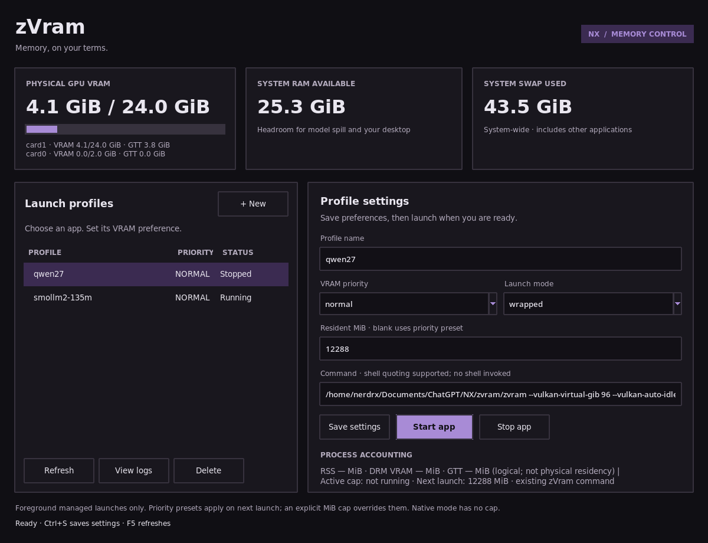

# zVram Manager



The GUI and TUI show managed profiles and detect other same-user zVram launches,
including Steam launch options and terminal commands. Detected external apps
show PID, RSS and available DRM memory accounting. Stop can terminate the
selected detected zVram process. Updated Vulkan paging launches also accept
live residency caps and priority presets. Ordinary apps
without zVram stay hidden and keep normal driver behavior. No root daemon,
system GPU settings, or Ollama service changes are required.

```sh
zvram gui
zvram tui
zvram manage status
```

High, normal, and low are launch-time eligible-buffer cap presets: 85%, 50%,
and 25% of the largest detected GPU's VRAM. An explicit Resident MiB value overrides
the preset. The TUI priority action clears that override. Profile changes
apply on the next launch. **Apply live** separately requests a runtime cap on
capable devices. These caps are neither
physical VRAM reservations nor a global priority scheduler. Native mode adds
no layer or cap; wrapped mode uses an existing zVram command.

For Steam, opt into the managed launcher explicitly:

```text
zvram run --name vrchat --priority high -- %command%
```

This selects experimental range paging with a launch cap and native-budget
headroom. Test per game; tracked buffers only, with images and unknown access
outside the narrow paging guarantee. The original `zvram --vulkan-virtual-gib
96 -- %command%` remains available with telemetry and Stop, but does not enable
live paging controls. To enable them in a Steam or terminal launch:

```text
zvram --live-control --vulkan-virtual-gib 96 -- %command%
```

`--live-control` opts into experimental range paging, a normal-priority initial
cap and 1536 MiB native-budget headroom. Explicit launch settings override its
defaults. This changes paging behavior; test compatibility per application.
Existing apps must restart once to load the updated layer and paging features.
The GUI provides **Apply live** (or **Save live cap** on a detected external app).
In the TUI, `p` selects a live preset and `e` sets MiB for an external app.

Live presets use 85%, 50% or 25% of each capable device's supported maximum.
Lowering stays pending while tracked resident memory exceeds the request;
the old cap stays active until the request fits naturally. No forced eviction
or device-wide wait is added. Requests outside supported bounds are rejected.
The UI shows the current cap, tracked residency, request and acknowledgment.
A later workload can still exceed a chosen cap and fail allocation, just as
with a launch-time cap. The cap controls eligible tracked buffers, not images
or total physical VRAM. It is not cross-application driver scheduling.

The private request/status files live under `$XDG_RUNTIME_DIR/zvram-control`,
or the manager state directory's `control` subdirectory when unavailable.
No service or elevated privileges are required. HIP live caps are unsupported.
Discovery refreshes about every two seconds. A configured launch environment
does not prove that the app has loaded the Vulkan layer; process details
distinguish configured launches from a mapped zVram backend. Process inspection
restrictions may prevent discovery or hide memory counters.
Programs must remain in the foreground; launchers that detach their game or
server are not supported for reliable stop/accounting.

GUI telemetry shows driver-reported physical GPU VRAM/GTT totals, system RAM
and swap, process RSS, and process DRM allocation accounting. The latter can
exceed physical VRAM and does not prove local residency. Limits are for tracked
allocations; they exclude driver overhead. Stop sends TERM to an owned worker,
which terminates its child session. External Stop sends TERM only to the selected
same-user PID after checking its start identity and opening a pidfd; it does not
signal Steam or unrelated process groups. SIGSTOP is not used because it retains VRAM.
Existing models and unrelated programs are never stopped automatically.

The worker stops its own process when available RAM falls below its floor or
system swap grows by more than 4 GiB from launch. Defaults: 16 GiB available
RAM for range-paged launches, 4 GiB otherwise. System swap includes unrelated
activity, so the guard is deliberately conservative. Logs show the reason.
This guard cannot guarantee an application or driver will not stall or OOM.

Profiles and logs live under `$XDG_STATE_HOME/zvram` (normally
`~/.local/state/zvram`), privately owned by the current user. Commands are
argument arrays and never invoke a shell. No login autostart is installed.

## Models in Novum Xenium

```sh
zvram model list
zvram model setup --model /path/model.gguf --alias zvram-my-model \
  --name my-model --compressed --resident-mib 12288 --cold-mib 8192 --port 8097
zvram manage start my-model
# Once the server is healthy:
zvram model register --alias zvram-my-model --port 8097
zvram manage stop my-model
```

The setup action saves a profile without launching it. Registration creates a
separate provider in Novum and leaves the current model/default untouched.
Use a different port for each simultaneously running model. The build needs
the optional BP16 GPU codec for compressed profiles. See the
[Novum handoff](novum-xenium-integration.md) for the provider integration API.
