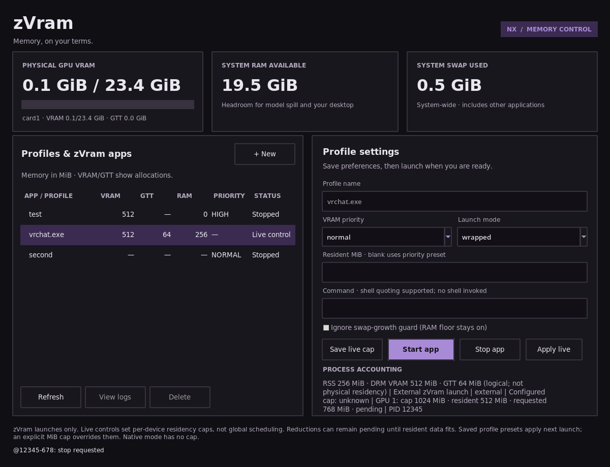

# Manager usage columns

Validated 2026-10-09 with the actual Tk widget fixture in headless Gamescope at 1200x920.
The screenshot uses FakeManager test data, not live GPU telemetry.

Command: `gamescope --backend headless --xwayland-count 1 -W 1200 -H 920 -- python3 test_zvram_ui.py --gui --screenshot`

The child printed `zVram UI checks passed (Tk widgets exercised)`. Checks cover VRAM/GTT/RAM columns, unknown versus zero counters, external live controls, diagnostic status, and per-profile swap-guard setting persistence/defaults. No game was started or stopped; this is GUI correctness, not paging or performance proof.

